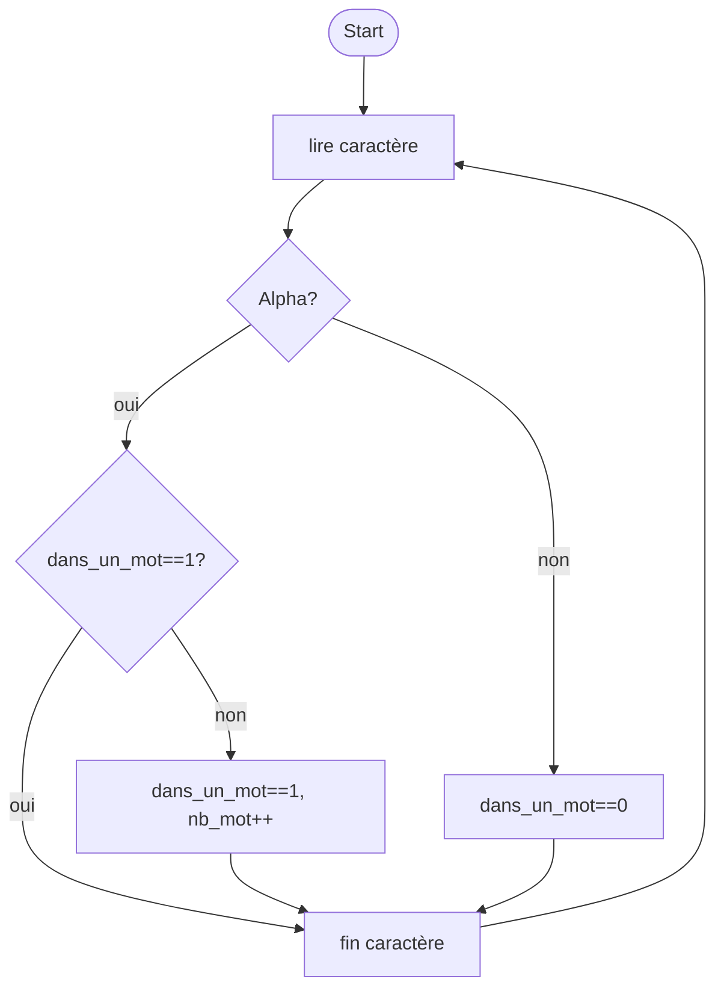

# TP Algo

Votre nom : 

Peer review :

## Consignes

Les critères d'evaluation sont :
- le fonctionnement correct de l'algorithme (coeff 2)
- la qualité de l'algorithme (coeff 1)
- pertinence des commentaires (coeff 1) 
- nommage des variables (coeff 1)
- qualité de l'affichage (coeff 1)

Chaque critère est évalué de 0 à 1 par pas de 0.25

Pour calculer l'évaluation finale, les 20 points seront repartis équitablement entre les différents exercices.  L'évaluation finale sera arrondie au demi point supérieur.

Pour chaque exercice vous donnerez votre algorithme et un exemple d'utilisation.

## 1 - température eau

écrire un algo demandant à l'utilisateur la température de l'eau et affichant l'état liquide, solide ou gazeux.

Code :
```

```

Affichage :
```

```

## 2 - calcul TVA

Ecrire un programme qui lit le prix HT d’un article, le nombre d’articles et le taux de TVA (par exemple 20%, entrez 20), et qui fournit le prix total TTC correspondant. Faire en sorte que des libellés apparaissent clairement.

Code :
```

```

Affichage :
```

```


## 3 - Compter les mots
Ecrivez un algorithme qui demande une phrase à l’utilisateur et qui affiche à l’écran le nombre de mots contenus dans cette phrase. Les mots sont des suites de caractères alphabétiques ( ["A"-"Z"] et ["a"-"z"] ). Les autres caractères sont considérés comme des séparateurs.

Exemple de résolution: (mais il y a plusieurs autres solutions...)

On cosidère que l'on est dans un mot si le dernier caractère lu est alpha [a-z] ou [A-Z]



Code :
```

```

Affichage :
```

```

## 4 - Aléatoire

Demandez à l'utilisateur le nombre de tirages aléatoires à réaliser. Chaque tirage sera un nombre entier entre 0 et 100.
Pour les nombres tirés :
- affichez le nombre minimum et maximum 
- Calculez et affichez la moyenne

Code :
```

```

Affichage :
```

```

## 5 - Calcul note

Ecrire un algorithme demandant à l'utilisateur le nombre d'exercices, puis pour chaque exercices les différents critères d'évaluation.

En option, vérifiez si le critère est multiple de 0.25

L'algorithme affiche pour chaque exercices:
- Les différents critères avec l'évaluation
- La note pour l'exercice
Puis à la fin, votre nom, le nom de votre peer review et l'évaluation finale.

Copiez ci-dessous les résultats de votre évaluation avec toutes les informations demandées:

Code :
```

```

Affichage :
```

```
